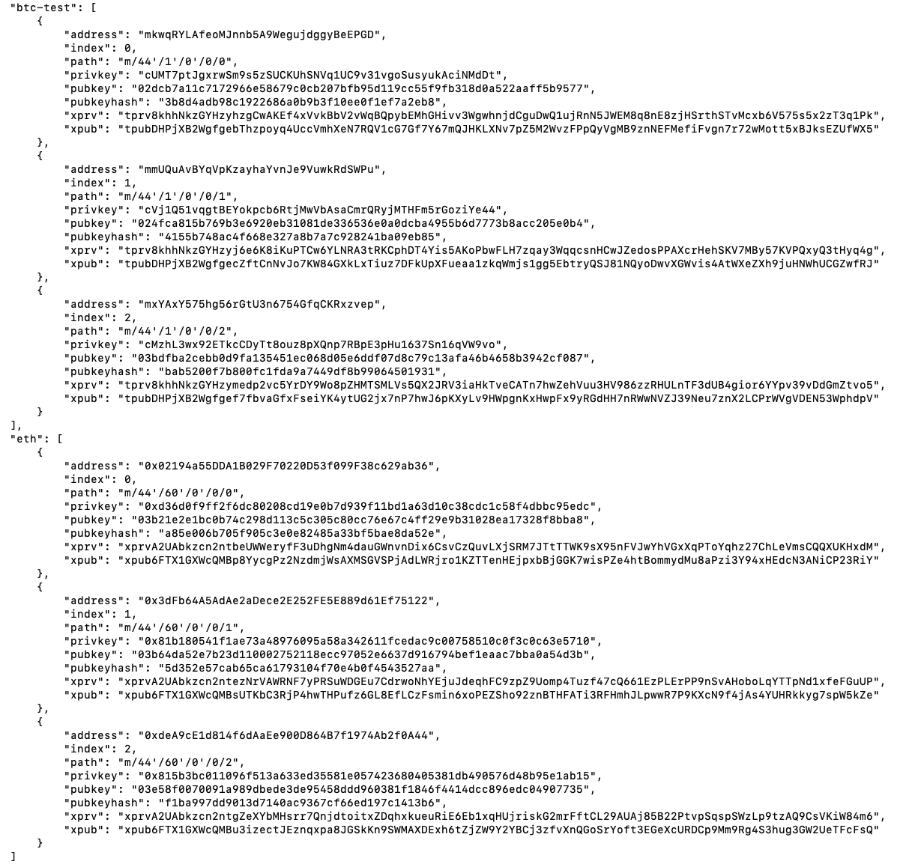
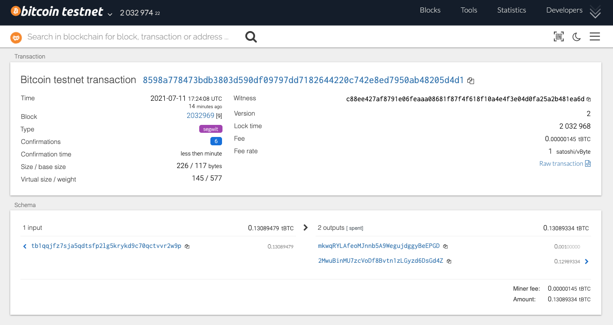
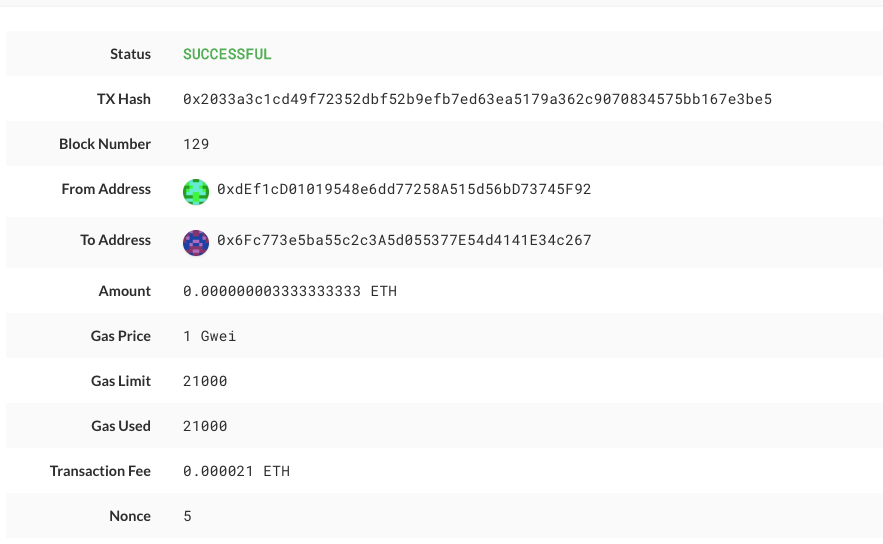

# Multi-Blockchain Wallet in Python

###  Derive the wallet keys
   - Used the following code to creating a private keys object 
  `def derive_wallets(mnemonic, coin, numderive):`
      - `command = f'php ./hd-wallet-derive/hd-wallet-derive.php -g --mnemonic="{mnemonic}" --numderive=" {numderive}" --coin="{coin}" --format=json' `
      `p = subprocess.Popen(command, stdout=subprocess.PIPE, shell=True)`
      `(output, err) = p.communicate()`
      `keys = json.loads(output)`
      `return  keys`
    - Create a coin object to hold child wallets
    `coins = {"eth", "btc-test"}`
    `numderive = 3`
    - Setting the dictionarry
    `keys = {}`
    `for coin in coins:`
      - `keys[coin]= derive_wallets(os.getenv('mnemonic'), coin, numderive=3)`

   - Creating a private keys object
`eth_PrivateKey = keys["eth"][0]['privkey']`
`btc_PrivateKey = keys['btc-test'][0]['privkey']`
`print(json.dumps(keys, indent=4, sort_keys=True))`
   - Screenshot of the wallet keys:
  

### Send some transactions!

  - **Bitcoin Testnet transaction**
    - Used the following code to send the transaction 
  `btc_PrivateKey = keys['btc-test'][0]['privkey']`
  `btc_acc = priv_key_to_account(BTCTEST,btc_PrivateKey)`
  `print(create_tx(BTCTEST,btc_acc,"mkwqRYLAfeoMJnnb5A9WegujdggyBeEPGD", 0.001))`
  `print(send_tx(BTCTEST,btc_acc,'mkwqRYLAfeoMJnnb5A9WegujdggyBeEPGD',0.001))`

    - Screenshot the confirmation of the transaction :

      

  - **Local PoA Ethereum transaction**
    - Used the following code to send the transaction 
  `eth_PrivateKey = keys["eth"][0]['privkey']`
  `eth_acc = priv_key_to_account(ETH,eth_PrivateKey)`
  `create_tx(ETH,eth_acc,"0x6Fc773e5ba55c2c3A5d055377E54d4141E34c267", 0.000000003333333333)` 
  `send_tx(ETH, eth_acc,"0x6Fc773e5ba55c2c3A5d055377E54d4141E34c267", 0.000000003333333333)`
    - Screenshot the successful transaction:

      

